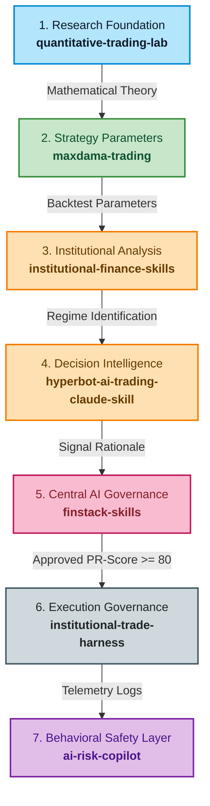
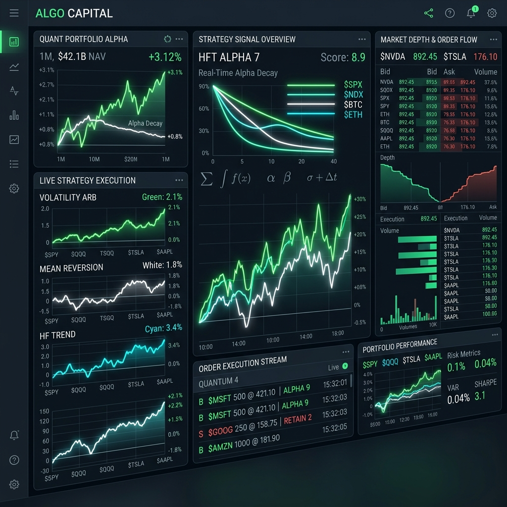
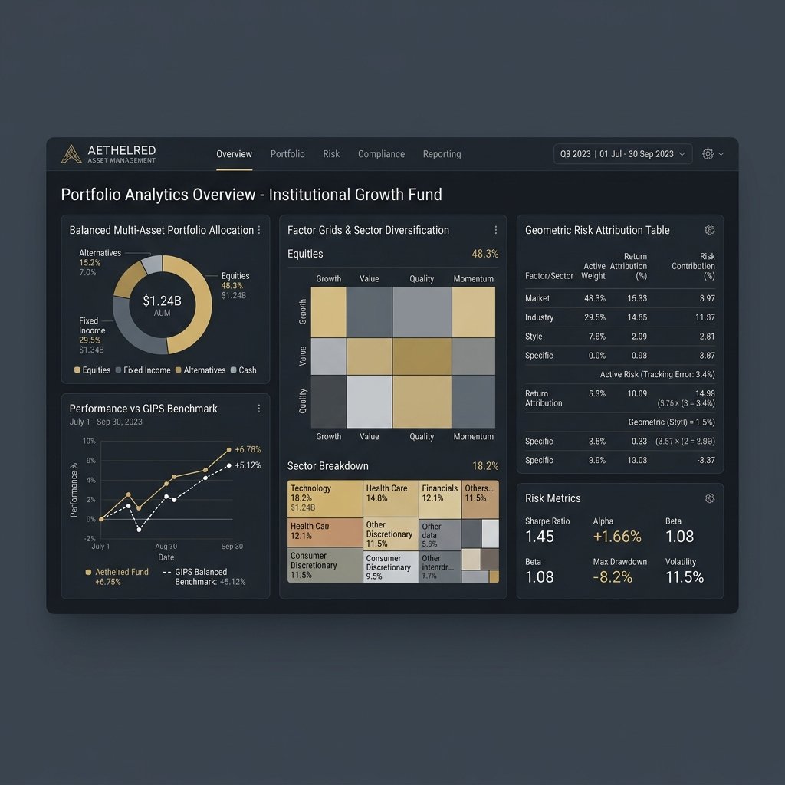
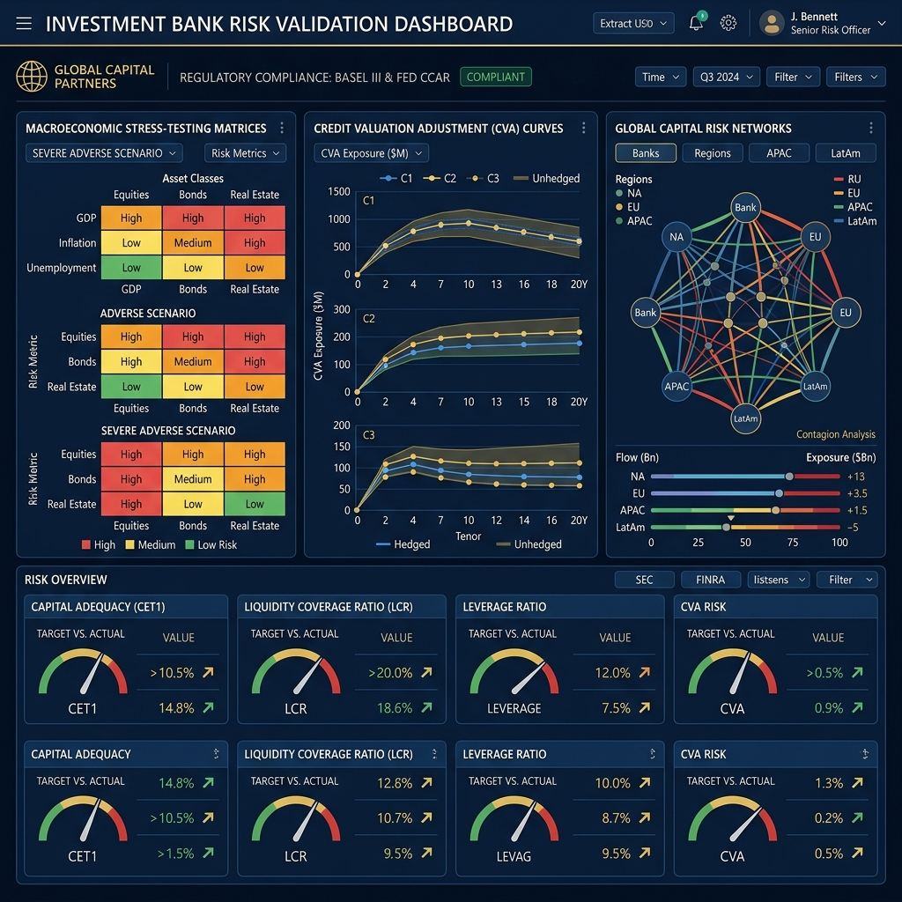

# FinStack Research

Financial AI should do more than optimize returns.

It should:
- **explain** decisions
- **validate** strategies
- **enforce** governance
- **monitor** risk
- **protect** investors
- **operate** transparently

The **FinStack Ecosystem** explores what AI-native financial infrastructure could look like.

---

## About Me

> **"I explore how AI systems should govern financial decision making."**  
> As an independent researcher, my work bridges the gap between financial systems engineering, multi-agent AI safety, and institutional model risk governance.

---

## The Problem

Most financial AI systems today focus only on prediction and execution. 

But institutional finance requires:
- **governance**
- **auditability**
- **explainability**
- **human oversight**
- **behavioral safeguards**
- **compliance-aware workflows**

Modern AI agents are powerful, but financial systems cannot rely on black-box decision making. 

---

## The Thesis

Future financial systems will not be single AI models. 

They will be layered ecosystems composed of:
- **reasoning engines**
- **governance layers**
- **risk intelligence systems**
- **validation harnesses**
- **human approval workflows**
- **investor-protection mechanisms**

FinStack explores this architecture.

---

## FinStack System Architecture

The repositories in this portfolio function as integrated system components of a unified AI-native financial operating system:

| System Component | Repository | Function |
|---|---|---|
| Quantitative Research Layer | `quantitative-trading-lab` | Quantitative strategy experimentation, market microstructure analysis, and foundational trading research |
| Systematic Strategy Layer | `maxdama-trading` | Translating academic market anomalies into systematic strategy frameworks and execution parameters |
| Financial Reasoning Layer | `finstack-skills` | Central AI-native reasoning and orchestration layer for quantitative research governance and financial workflows |
| Governance & Execution Layer | `institutional-trade-harness` | Strategy validation, pre-trade governance gates, compliance-aware execution controls, and audit oversight |
| Risk Intelligence Layer | `ai-risk-copilot` | Explainable investor-risk analysis, behavioral finance safeguards, and retail investor protection mechanisms |
| Institutional Intelligence Layer | `institutional-finance-skills` | Institutional-grade financial workflows including macro analysis, sector rotation, and portfolio intelligence |
| Market Decision Intelligence Layer | `hyperbot-ai-trading-claude-skill` | Explainable AI reasoning framework for risk-aware market interpretation and financial decision support |

---

## End-to-End System Workflow

This diagram visualizes how a quantitative trading idea moves sequentially through our portfolio layers, scaling from base academic theory to live, compliance-controlled execution and safety monitoring:

---

## Research Questions

My work in this ecosystem seeks to address several fundamental research questions at the intersection of quantitative finance and AI systems:
- **Model Validation:** How should AI systems validate quantitative trading strategies to prevent selection bias and overfitting?
- **Investment Governance:** Can LLMs and multi-agent pipelines improve institutional model risk governance and comply with supervisory standards (e.g., SR 11-7)?
- **Explainability (XAI):** How can explainable AI reduce behavioral and financial risk for retail investors without diluting advanced model performance?
- **Human-in-the-Loop:** What does a robust, legally compliant human-in-the-loop systematic trading infrastructure look like?
- **Regulatory Gateways:** How should autonomous AI reasoning agents interact with highly regulated market-access gates (e.g., SEC 15c3-5, MiFID II)?

---

## Why This Matters

As AI systems increasingly participate in financial decision making, the industry will require infrastructure that is:
- **explainable**
- **auditable**
- **governed**
- **institution-aware**
- **human-supervised**
- **safety-oriented**

The next generation of financial infrastructure will not just automate markets. **It will govern them.**

---

## Selected Projects

### [FinStack AI Governance Layer](https://github.com/rigneshroot/finstack-skills)
*Central AI-native operating system for quantitative research governance.*
- Integrates a 6-stage quant research lifecycle pipeline consisting of independent validator agents (Research Director, Backtest Auditor, Model Risk Officer, Risk Manager, and Red Team).
- Enforces strict review escalations, PR-Score matrices, and mathematical assumptions testing (Augmented Dickey-Fuller stationarity, Jarque-Bera residual normality).

### [Institutional Trade Harness](https://github.com/rigneshroot/institutional-trade-harness)
*Execution governance and regulatory gateway framework for systematic trading systems.*
- Connects signal outputs to pre-trade gateway risk gates under **SEC Rule 15c3-5** (Single Order Limits, capital caps, price collars).
- Integrates automated, manual kill-switches and microsecond-level FIX execution logging complying with **FINRA CAT** audit guidelines.

### [AI Risk Copilot](https://github.com/rigneshroot/ai-risk-copilot)
*Explainable AI sandbox for retail investor-risk analysis and behavioral protection.*
- Translates institutional risk indicators into plain-English behavioral alerts.
- Combines natural language explainability with risk-scoring dashboards to shield retail and teen investors from emotional over-trading.

### [Hyperbot Decision Intelligence Layer](https://github.com/rigneshroot/hyperbot-ai-trading-claude-skill)
*Claude-based AI reasoning and decision intelligence layer for market workflows.*
- Leverages Explainable AI (XAI) to produce logical, auditable rationales for quantitative portfolio decisions.
- Integrates risk-context layers and institutional constraints directly into Claude agent workflows.

---

## Visualizing the Institutional Verticals

This portfolio supports three core institutional divisions, simulated and audited through specialized real-time dashboards:

### 1. Hedge Fund Signal & Execution Dashboard
*Monitors high-speed trade execution, alpha decay half-lives, and market liquidity depth.*

---

### 2. Asset Management Allocation & Factor Matrix
*Tracks multi-asset portfolio diversification, sector exposure grids, and benchmark comparisons.*

---

### 3. Investment Bank Risk & Regulatory Validation
*Simulates macroeconomic CCAR stress replays, credit valuation adjustments (CVA), and capital contagion.*

---

## Long-Term Vision

The long-term goal is to explore how AI systems can evolve from isolated assistants into coordinated financial operating systems capable of:
- **Institutional-grade oversight** of automated trading systems.
- **Dynamic portfolio intelligence** that adapts to macroeconomic regime shifts.
- **Automated strategy validation** preventing mathematical overfitting and selection bias.
- **Real-time behavioral risk detection** protecting retail and sovereign capital.
- **Unified human-in-the-loop governance** over low-latency execution gateways.

---

## Disclaimer

All projects are for research, education, and prototype development. They do not constitute financial advice and should not be used for live trading without professional validation, robust risk controls, and compliance review.
